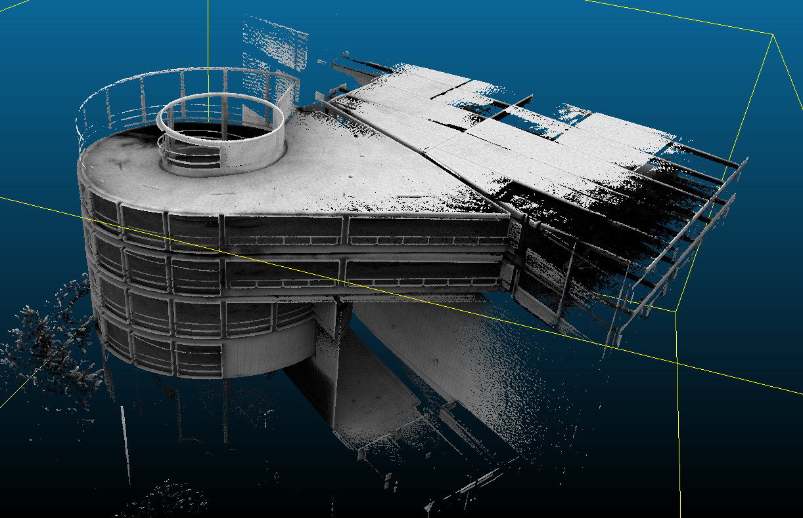
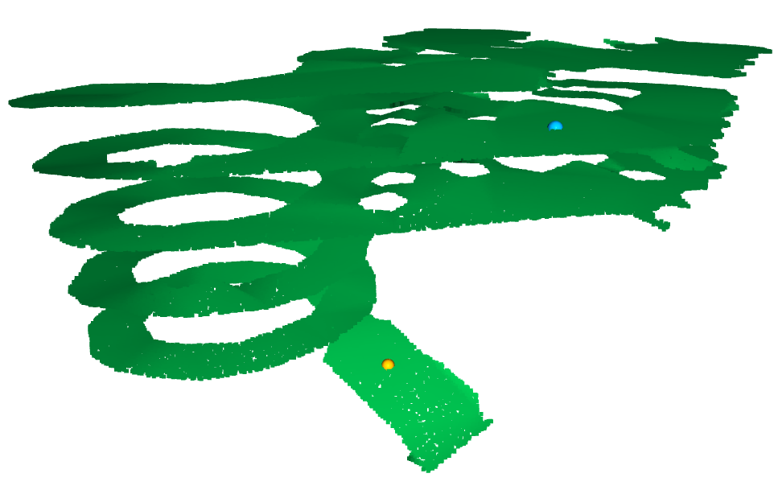
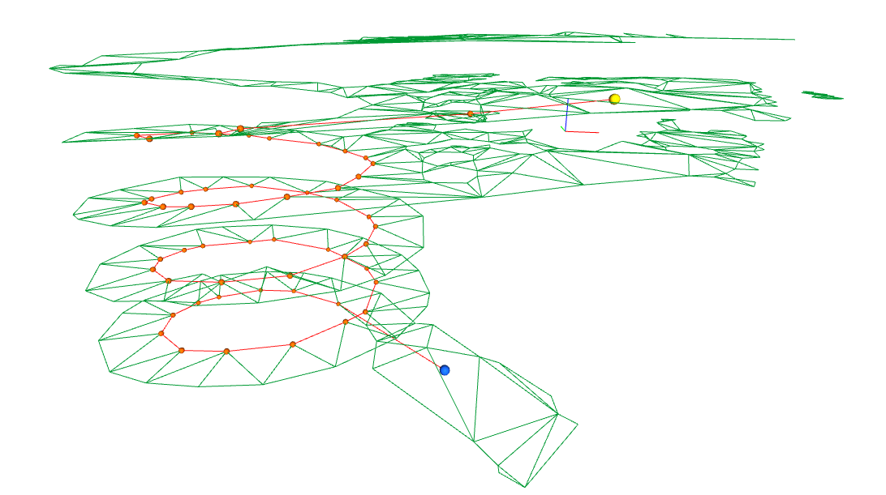

# voxelize_navmesh

Point cloud → voxel mesh → Recast navmesh → Python path queries with Open3D visualisation.



---

## Quick start

```bash
# 1. Clone with submodule
git clone --recurse-submodules https://github.com/<your-username>/voxelize_navmesh.git
cd voxelize_navmesh

# 2. Set up Python environment (conda, avoids NumPy 1/2 conflicts)
conda env create -f environment.yml
conda activate voxnav

# 3. Build Recast libraries (one-time, ~1 min)
cmake -S recastnavigation -B recastnavigation/build \
      -DCMAKE_BUILD_TYPE=Release \
      -DCMAKE_POSITION_INDEPENDENT_CODE=ON
cmake --build recastnavigation/build

# 4. Build this project
cmake -S . -B build -DCMAKE_BUILD_TYPE=Release
cmake --build build

# 5. Try interactive path picking on the sample navmesh
python query_path.py test_navmesh.bin
```

---

## Full pipeline

```
scene.pcd  (Z-up)
    │
    │  export_obj.py          voxelise + write Y-up OBJ
    ▼
scene.obj  (Y-up)
    │
    ├── RecastDemo            open OBJ → tweak params → bake → Save
    │                         produces:  solo_navmesh.bin
    │
    └── recast_cli            headless bake (no GUI needed)
             --save-bin       produces:  scene.bin
    │
    ▼
scene.bin  (Y-up internally, transparent to Python)
    │
    ├── view_navmesh.py       Open3D overlay: PCD + navmesh wireframe
    └── query_path.py         Interactive or batch Detour path query
```

---

## Step-by-step

### 0 — Clone (if you haven't already)

```bash
git clone --recurse-submodules https://github.com/<your-username>/voxelize_navmesh.git
cd voxelize_navmesh
```

If you already cloned without `--recurse-submodules`:

```bash
git submodule update --init --recursive
```

---

### 1 — Set up Python environment

A conda environment is provided to avoid NumPy 1.x / 2.x binary-compatibility
crashes in open3d, scikit-learn, pandas, numexpr, and bottleneck.

```bash
conda env create -f environment.yml
conda activate voxnav
```

> **Why conda?**  The system `pip` packages for `numexpr` and `bottleneck` on
> many distros are compiled against NumPy 1.x.  If your system Python has
> NumPy 2.x, `import open3d` crashes deep inside `open3d.ml`.  The conda
> environment pins `numpy<2` and installs all packages from conda-forge with
> matching ABIs.

---

### 2 — Build

#### 2a — Recast (one-time)

```bash
cmake -S recastnavigation -B recastnavigation/build \
      -DCMAKE_BUILD_TYPE=Release \
      -DCMAKE_POSITION_INDEPENDENT_CODE=ON
cmake --build recastnavigation/build
```

> `POSITION_INDEPENDENT_CODE=ON` is required so that `libDetour.a` can be
> linked into `navmesh_bridge.so`.  If you already built without this flag,
> re-run the configure step above and rebuild.

#### 2b — This project

```bash
cmake -S . -B build -DCMAKE_BUILD_TYPE=Release
cmake --build build
```

| Output | Description |
|--------|-------------|
| `build/recast_cli` | Headless navmesh bake + JSON path query CLI |
| `build/navmesh_bridge.so` | C shim loaded by `navmesh.py` via ctypes |

---

### 3 — Export OBJ from point cloud

```bash
python export_obj.py scene.pcd scene.obj
```

No extra flags needed for a standard Z-up PCD — `swap_yz=True` is the default
and produces a Y-up OBJ that Recast expects.

| Flag | Effect |
|------|--------|
| `--voxel-size 0.1` | Override auto voxel size |
| `--method greedy` | Meshing method: `naive`, `greedy`, `marching_cubes` |
| `--no-swap-yz` | Disable axis swap (only if PCD is already Y-up) |

---

### 4 — Bake navmesh

#### 4a — RecastDemo (GUI, recommended for first-time tuning)

```bash
# Build RecastDemo (if not already built)
cmake --build recastnavigation/build --target RecastDemo

./recastnavigation/build/RecastDemo/RecastDemo
```

1. Load `scene.obj`
2. Adjust agent height / radius / max climb / cell size
3. Click **Build** → **Save** → saves `solo_navmesh.bin`

#### 4b — recast_cli (headless)

```bash
./build/recast_cli scene.obj  <sx> <sy> <sz>  <ex> <ey> <ez> --save-bin scene.bin
```

> Coordinates here are **Y-up** (Recast frame) because they go directly to
> the C++ binary.  Use `query_path.py` for Z-up input (see step 6).

---

### 5 — Visualise navmesh over point cloud

```bash
python view_navmesh.py scene.pcd scene.bin
```

- Green wireframe = navmesh detail polygons (aligned with PCD)
- Orange boxes = per-tile AABBs
- RGB lines at origin = XYZ axes

---

### 6 — Query a path

#### Interactive mode (click start + end in 3-D viewer)

```bash
# With point cloud (best experience — click on your scene)
python query_path.py scene.bin --pcd scene.pcd

# Without PCD (clicks on sampled navmesh surface)
python query_path.py scene.bin
```

**Picking controls:**

| Input | Action |
|-------|--------|
| `Shift + left-click` | Pick a point (first = START, second = END) |
| `Q` / close window | Confirm selection and compute path |



The viewer then opens a result window showing the computed path:
- **Blue sphere** = start (snapped to nearest navmesh polygon)
- **Yellow sphere** = end
- **Red line + orange dots** = waypoints



After closing the result window the terminal asks `Pick again? [y/N]` so you
can keep trying routes without restarting.

#### Batch mode (explicit Z-up coordinates)

```bash
python query_path.py scene.bin  <sx> <sy> <sz>  <ex> <ey> <ez>

# With point cloud overlay
python query_path.py scene.bin -8 0 -3  8 0 -3 --pcd scene.pcd

# Larger snap extents if start/end snapping fails
python query_path.py scene.bin -8 0 -3  8 0 -3 --extents 4 6 4

# Skip visualisation (print waypoints only)
python query_path.py scene.bin -8 0 -3  8 0 -3 --no-vis
```

All coordinates are **Z-up** (PCD frame).  Waypoints are also Z-up, ready for
use with Open3D or ROS.

#### Python API

```python
from navmesh import NavMesh, NavMeshQuery
import numpy as np

nm = NavMesh("scene.bin")

# Navmesh geometry for Open3D (Z-up, all tiles merged)
verts, tris = nm.get_geometry()   # (N,3) float32, (M,3) int32

# Path query — everything in Z-up
with NavMeshQuery(nm) as q:
    path = q.find_path(
        start_zup=np.array([-8, 0, -3], dtype=np.float32),
        end_zup  =np.array([ 8, 0, -3], dtype=np.float32),
    )
    # path: (K, 3) float32 waypoints, Z-up

nm.close()
```

---

## Coordinate conventions

| Space | Up axis | Used by |
|-------|---------|---------|
| **Z-up** | Z | Original PCD, Open3D, all Python scripts |
| **Y-up** | Y | Recast/Detour internally, OBJ fed to Recast, `.bin` files |

`export_obj.py` converts Z-up → Y-up when writing the OBJ.
`navmesh.py` converts Y-up → Z-up when reading the `.bin`.
You never need to think about this in day-to-day use.

---

## Repository structure

```
├── CMakeLists.txt             Build: recast_cli + navmesh_bridge.so
├── environment.yml            Conda env (numpy<2, open3d, trimesh, …)
│
├── export_obj.py              PCD → Y-up OBJ (voxel mesh)
├── voxel_navmesh.py           Voxelisation + meshing library
│
├── recast_cli.cpp             C++ CLI: OBJ → navmesh bake + optional .bin save
├── navmesh_bridge.cpp         extern "C" shim over dtNavMesh / dtNavMeshQuery
├── navmesh.py                 Python ctypes wrapper (Z-up public API)
│
├── view_navmesh.py            Open3D viewer: PCD + navmesh wireframe overlay
├── query_path.py              Interactive + batch path query with Open3D vis
│
├── test_navmesh.bin           Sample navmesh (baked from voxel_mesh_yup.obj)
└── recastnavigation/          Submodule → github.com/recastnavigation/recastnavigation
```

---

## Troubleshooting

**`import open3d` crashes with NumPy ABI error**
Use the conda environment: `conda activate voxnav`.
The system Python may have NumPy 2.x while system packages (numexpr, bottleneck)
were compiled against 1.x.

**Navmesh doesn't overlap the point cloud**
The OBJ was exported without the Y↔Z swap.  Re-run `export_obj.py` without
`--no-swap-yz`.

**`nm_load` returns null / "Failed to load navmesh"**
The `.bin` file is not in RecastDemo format.  Check the magic bytes:
```bash
python -c "
import struct
with open('scene.bin','rb') as f: d=f.read(4)
print(d, hex(struct.unpack('<I',d)[0]))
# Should print: b'MSET' ...
"
```

**Start/end point not on navmesh**
Default snap extents `(2, 4, 2)` may be too tight.  Use `--extents 5 8 5`
or pick a point closer to a walkable surface.

**`libDetour.a` relocation error when building `navmesh_bridge`**
Rebuild recastnavigation with `-DCMAKE_POSITION_INDEPENDENT_CODE=ON`
(see build section above).

**Submodule folder is empty after cloning**
```bash
git submodule update --init --recursive
```
